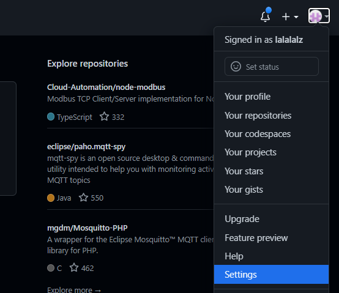
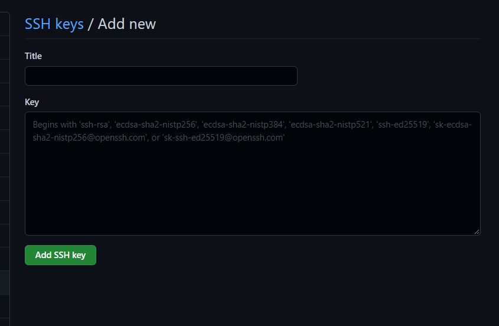

# Git 여러 계정 사용하기

## 1. 설정방법
  여기서 다루는 내용은 모두 리눅스 환경에서 진행됐다. 그러나 윈도우에서도 설정방법이 크게 다르지 않으므로 해당 내용을 통해 적용시킬 수 있다.

### 2.1. SSH 클라이언트 설정
----------------------------------------------------------------------------------------------------

### 2.2. SSH 키 생성
----------------------------------------------------------------------------------------------------
  다음 명령어를 통해 SSH Key를 생성한다.  해당 명령은 두개의 옵션을 지정해 주었다. 첫번째로 지정해준 -t 옵션은 암호화 옵션을 의미하고, -f는 지정할 파일명을 의미한다. 

``` bash
	
	*****@DESKTOP-U8SM MINGW64 cd ~/.ssh/
	*****@DESKTOP-U8SM MINGW64 ssh-keygen -t rsa -f 'MyKey'

```

  위의 명령어를 통해 공개키와 개인키가 생성되고, 해당 키들은 ~/.ssh 폴더에 생성되었다. 그리고 해당 키들은 다음과 같은 형태로 생성된다. 이때, .pub으로 끝나는 파일이 공개키에 해당한다.

``` bash

	~/.ssh/
	Mykey      MyKey.pub

```

  여기서는 여러 계정을 사용하기 위해 하나의 키를 추가로 생성한다. 

``` bash

	*****@DESKTOP-U8SM MINGW64 cd ~/.ssh/
	*****@DESKTOP-U8SM MINGW64 ~/.ssh/ ssh-keygen -t rsa -f 'MyKey2'
	*****@DESKTOP-U8SM MINGW64 ~/.ssh/ ls

	Mykey  Mykey.pub  Mykey2 Mykey2.pub

```

### 2.3. SSH config 파일 수정
----------------------------------------------------------------------------------------------------
  ~/.ssh/config 파일을 생성한 뒤에 다음과 같은 내용을 추가한다.

``` terminal

	Host MyKey (꼭 생성된 키의 이름과 동일하지 않아도 됨)
		HostName github.com
		User git
		IdentityFile ~/.ssh/MyKey
	
	Host MyKey2
		HostName github.com
		User git
		IdentityFile ~/.ssh/MyKey

```


### 2.4. SSH 키 등록
----------------------------------------------------------------------------------------------------
  위에서 생성한 공개키를 각각의 github 계정에 등록한다. 

|  |  |
| :-------------------------------------: | :----------------------------------------------------------: |
|  |  |


### 2.5. 여러 계정 사용하기
----------------------------------------------------------------------------------------------------
  위의 과정들이 완료됐다면 모든 준비는 끝이났다. 이제 config 파일에서 지정한 Host 명으로 다음과 같이 remote를 각각 설정하면, 각각의 원격 레파지토리에 접근할 수 있다. 이제 한 컴퓨터에서 여러명이 각기 다른 깃허브를 사용할 수 있다.

``` terminal

	*****@DESKTOP-U8SM MINGW64 git remote add origin git@MyKey:'깃허브 아이디'/'원격 레파지토리'.git

```