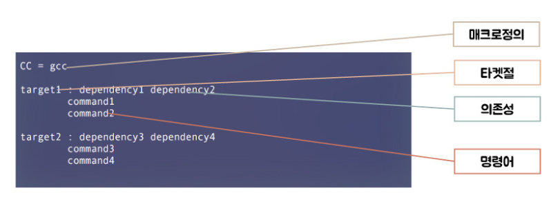
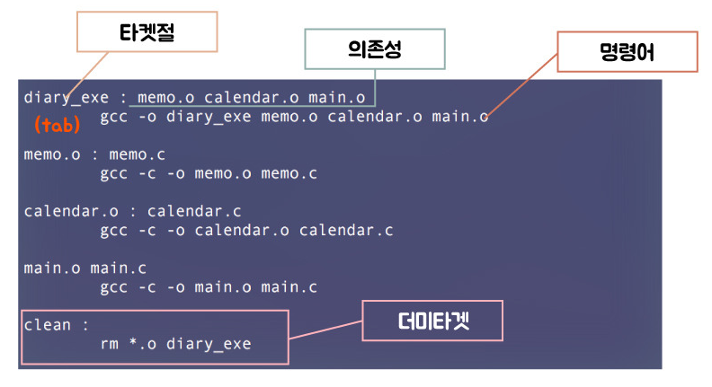

# 리눅스 C/C++ 빌드 과정

## 1. 개요
* * *
  리눅스에서 C/C++ 개발 환경을 구축하기 위한 관련 개념들과 구축방법에 대해 정리한다. 

## 2. C/C++ 빌드 과정
* * *
  C/C++로 개발된 코드를 실행파일로 만들어 실행하기 위한 과정에 대해 알아본다. 

#### 2.1. 빌드
  C/C++로 개발된 코드는 다음과 같은 과정들을 거쳐 실행파일을 생성한다. 그림의 왼쪽은 과정을 통해 생성된 파일의 형식이 표현되어 있으며, 오른쪽은 각 과정이 표현되어 있다.


#### 2.2. 전처리
  코드를 실행파일로 만드는 과정의 가장 첫번째는 전처리과정이 진행된다. 이 과정은 컴파일 직전에 실행되는 과정이며, 코드에서 전처리 지시자를 찾아 처리한다. 전처리 지시자는 #으로 시작하며, 전처리기를 통해 처리된다. 더욱 자세한 내용은 전처리 포스트에서 다루도록 하겠다.

``` c
	#include <stdio.h> // 헤더파일
	#define LED 1	   // 매크로
```

#### 2.3. 컴파일

  전처리 과정이 끝난 후엔 컴파일 과정이 진행되는데 이때, 코드가 컴파일러에 의해 어셈블리어로 변환된다. 

#### 2.4. 어셈블

  어셈블리어로 변환된 파일은 어셈블러에 의해 기계어로 변환된다. 이때, 변환된 파일은 목적파일이라 불리며, **.o**의 확장자를 갖는다. 

#### 2.5. 링크

  하나의 프로그램은 여러 소스코드로 개발된다.. 따라서, 하나의 프로그램으로 만들기 위해 여러 소스코드의 오브젝트 파일들이 서로 연결시켜야 하는데 이 과정을 링크라고 한다. 


## 3. 빌드 도구(GCC)
* * *
  리눅스에서는 앞서 알아본 빌드 과정을 쉽게 도와주는 여러 도구들이 있다. 그 중 대표적으로 GCC가 존재한다. GCC는 전처리 과정, 컴파일 과정, 어셈블 과정, 링킹 과정을 수행할 수 있다. 다음 그림의 빌드과정을 GCC를 이용하여 처리해보자. 


#### 3.1. 기본개념
  GCC는 다음과 같은 명령어를 통해 하나의 소스파일을 빌드과정을 거쳐 하나의 실행파일로 생성해준다. -o 옵션은 원하는 출력물의 이름을 지정해 줄 수 있게 한다.

``` terminal
	gcc -o TEST TEST.c // 결과물 실행파일(TEST)
```

#### 3.2. object 파일 생성하기
  하나의 파일만을 실행파일로 만드는 과정은 **3.1. 기본개념**에서 알아본 명령어만으로 가능하다. 그러나 위의 그림과 같이 여러 파일로 이루어진 프로그램을 빌드하기 위해서는 **3.1. 기본개념**에서 알아본 명령어만으로는 부족하다. 

  우선, 각각의 파일을 **3.1.**에서 알아본 명령어를 이용하여 각각의 오브젝트 파일을 생성한다. -c 옵션은 .c 파일을 통해 .o 파일을 생성한다. 

```terminal
	gcc -c -o memo.o memo.c
	gcc -c -o calendar.o calendar.c
	gcc -c -o main.o main.c
```

#### 3.3. 링크
  다음은 각각 생성된 object 파일을 묶어 하나의 실행파일을 만든다. 이때, object 파일의 순서는 중요하지 않다.

```terminal
	gcc -o diary_exe main.o memo.o calendar.o
```

## 4. 빌드 도구(Make)
* * *
  앞서 **3. 빌드도구(GCC)**에서 알아본 내용을 통해 한번의 빌드과정을 처리할 수 있다. 그러나 실제 개발을 진행하는 동안 여러번의 빌드과정을 마주하게 된다. 이때, **3. 빌드도구(GCC)**에서 알아본 내용을 통해서 매번 빌드를 진행한다는 것은 번거로운 일이다.

  Make는 이 빌드 과정의 단순 반복 작업을 최소화 및 자동화 할 수 있게 도와주는 도구이다. 빌드의 과정을 파일에 작성하여 빌드과정의 반복 작업을 대체할 수 있게 해준다. 다음을 통해 Make에 대해 알아본다. 

#### 4.1. Makefile 이란
  앞서 설명한 빌드 과정을 표현한 파일이며, 이 파일을 통해 실제로 빌드가 진행된다. 

#### 4.2. Makefile 기본구조
  Makefile은 다음과 같은 구조를 가지고 있다. 타켓절은 생성하고자 하는 목표 파일을 의미하며, 의존성은 해당 타겟절을 만들기 위해 필요한 구성요소들을 의미한다. 그리고 명령어는 해당 목표파일을 만들기 위해 실제로 달성하기 위한 명령어를 의미한다. 



#### 4.4. 예제
  **3.1.**에서 살펴본 그림의 빌드과정을 실제로 다음과 같이 Makefile로 나타낼 수 있다. 여기서 눈여겨 볼 점은 더미타겟이다. 해당 더미 타켓은 생성된 모든 목적파일과 생성된 실행파일을 삭제하는 부분이다. 즉, 한번의 빌드과정을 진행한 뒤에 또 다른 빌드과정을 위해 이전에 생성된 파일들을 모두 삭제할 수 있는 타겟이다.



