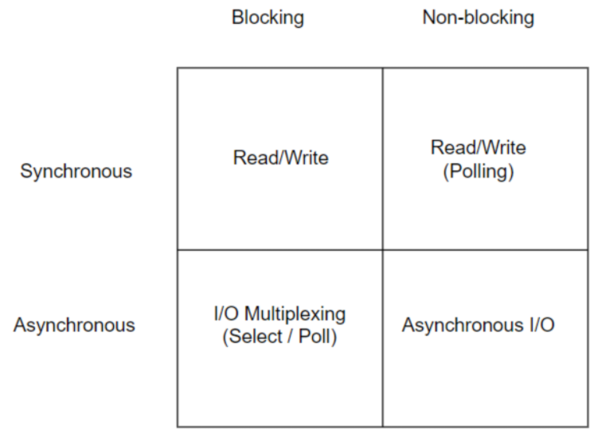

# I/O Model

## 1. 개요
* * *
  I/O 작업은 어플리케이션과 커널사이에서 이루어지는 작업이다. 즉, 요청자(호출자)와 요청을 처리하는 대상(호출되는 대상)으로 구분지을 수 있다. 그리고 이런 경우에 여러 방식으로 요청을 처리할 수 있다. 다음을 통해 알아보자. 

## 2. Blocking vs Non-Blocking
* * *
  Blocking과 Non-Blocking를 구별짓는 기준은 요청자가 자신의 작업을 멈추고 대기하는지 아니면 대기하지 않는지이다.(return을 바로 하는지 아닌지로 표현될 수 있다) 자신의 작업을 멈추고 대기한다면 Blocking, 그렇지 않다면 Non-Blocking 방식이다. 

#### 2.1. Blocking 
  요청한 작업이 완료될 때까지 제어권을 넘기고 대기한다. 그리고 작업이 완료되면 제어권과 결과값을 돌려받고 작업을 이어간다. 

#### 2.2. Non-Blocking
  Non-Blocking 방식은 요청한 작업이 완료되지 않았음에도 결과값과 제어권을 넘겨받아 대기하지 않고 작업을 이어간다. 이때, 결과값은 완료되지 않았기 때문에 정상적인 결과값이 아니다.

## 3. Syncronous vs Asyncronous
* * *
  Sync와 Async를 구분짓는 기준은 요청 완료 여부를 어디에서 확인하고 신경쓰느냐이다. 만약, 호출자에서 신경쓰고 결과값을 받아 처리한다면 Sync, 호출자는 Callback과 요청 작업을 호출되는 대상에게 넘기고 호출자는 신경쓰지 않는다면 Async이다. 이때, 호출되는 대상은 결과값에 따른 Callback 처리를 진행한다. 

#### 3.1. Syncronuous 
  요청자가 요청한 작업의 완료 여부를 직접 확인하여 결과값을 돌려받아 자신이 처리하는 방식이다.

#### 3.2. Asyncronous 
  요청자는 요청한 작업의 완료 여부를 직접 확인하지 않는다. 다만, callback을 요청한 작업과 같이 넘겨 호출되는 대상이 완료 여부에 따라 callback을 처리하도록 하는 방식이다. 

## 4. 조합
* * *
  **2.**과 **3.**을 통해 알아본 개념들은 비슷한 개념으로 이해된다. 그러나 두 그룹은 관점의 차이가 있다. Blocking과 Non-Blocking은 대기의 여부라는 관점으로 구분되고, Sync와 Async는 요청 작업의 완료 여부의 확인 주체성이라는 관점으로 구분된다.  따라서, 두 그룹은 조합되어질 수 있다. 

#### 4.1. Sync Blocking
  요청한 작업을 대기하며 결과값을 직접 처리한다. 

#### 4.2. Async Blocking
  요청한 작업과 Callback을 넘긴 후에 대기한다. 요청이 완료되어 Callback 처리가 이루어진 후에 대기를 멈춘 후 자신의 작업을 이어간다.  

#### 4.3. Sync Non-Blocking
  요청한 작업을 대기하지 않으나, 지속적으로 요청 결과값을 확인한다. 

#### 4.4. Async Non-Blocking
  요청한 작업과 Callback을 넘긴 후에 요청한 작업을 대기하지 않으며, 요청 결과값을 확인하지 않는다.

## 4. I/O Model
* * *
  위에서 언급했듯이 I/O작업은 어플리케이션과 커널 사이에서 진행된다. 즉, 어플리케이션은 I/O작업을 커널에 요청하며 커널은 요청한 작업을 처리한다. 따라서, 위의 방식을 도입해 I/O 처리를 할 수 있다. 다음 그림을 통해 알아보자. 

