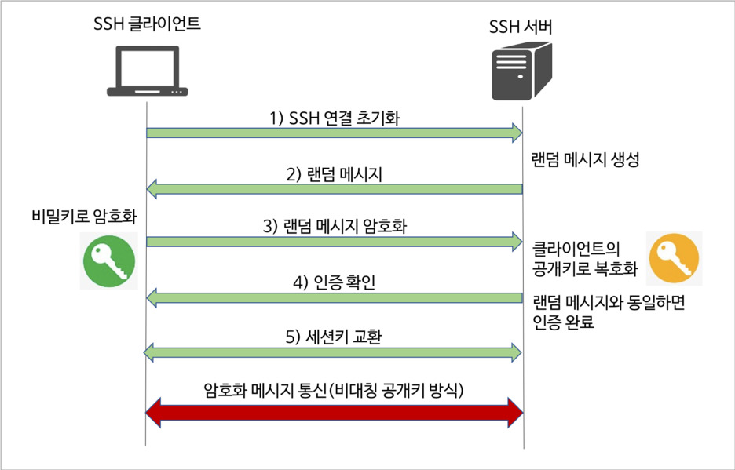
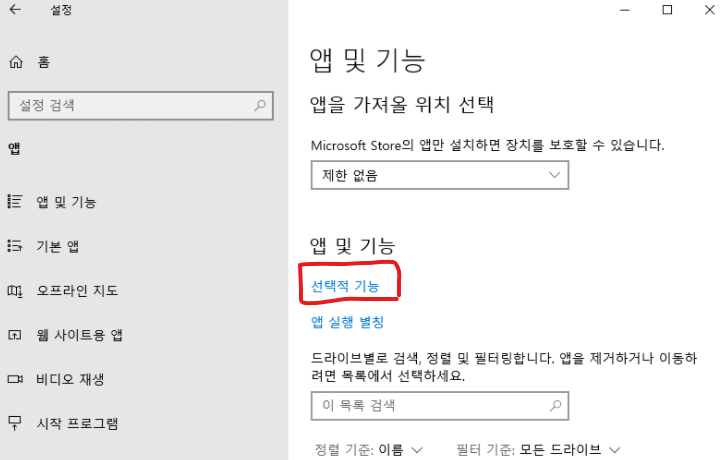
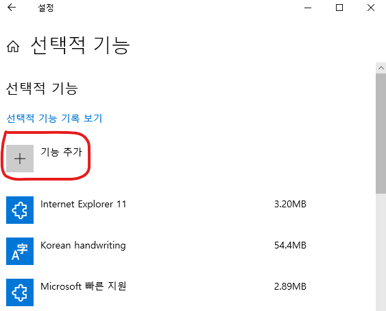
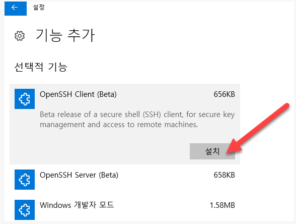

# 우분투 SSH 설정

## 1. 우분투 SSH 설정

### 1.1. SSH Sever 설치
--------------------------------------------------------------------------------
  원격으로 접속할 PC의 Open SSH Server를 설치한다. 

``` terminal

	$ sudo apt update
	$ sudo apt install openssh-server

```

### 1.2. SSH Sever 실행 확인
--------------------------------------------------------------------------------
  SSH를 설치하면 자동으로 실행되며 다음 명령어를 통해 실행을 확인할 수 있다.

``` terminal

	$ sudo systemctl status ssh
	ssh.service - OpenBSD Secure Shell server
   	  Loaded: loaded (/lib/systemd/system/ssh.service; enabled; vendor preset: enabled)
      Active: active (running) since Tue 2021-08-03 19:12:39 KST; 6h ago
        Docs: man:sshd(8)
              man:sshd_config(5)
    Main PID: 22984 (sshd)
      Tasks: 1 (limit: 19102)
     Memory: 8.9M
     CGroup: /system.slice/ssh.service
             └─22984 sshd: /usr/sbin/sshd -D [listener] 0 of 10-100 startups

```

### 1.3. SSH 작동원리
--------------------------------------------------------------------------------
  Secure Shell Protocol의 약어로 네트워크 프로토콜이다. 다른 인터넷 서비스 프로토콜보다 보안성이 뛰어나다는 특징을 가지고 있어 원격 제어 상황에서 사용할 수 있다. 

  SSH는 SSH-Sever에 접속할 때 비대칭키 방식을 사용하여 SSH-Client를 인증한다. 그렇게 인증이 된 후에는 대칭키 방식을 사용하여 메시지를 주고받는다. 이와 같은 절차들을 통해 보안성을 확보하는 것이다. 

#### 1.3.1. 클라이언트 인증
  클라이언트가 서버에 공개키를 전달하면 서버는 해당 공개키를 이용하여 랜덤한 값을 생성하여 클라이언트로 전송한다. 만약, 해당 클라이언트가 유효하다면 전송받은 랜덤한 값을 복호화 하여 해당 값을 서버로 전송한다. 마지막으로 서버는 전달받은 값을 처음 만들 때 사용했던 값과 같은지 비교하여 같으면 인증을 마친다. 

#### 1.3.2. 서버 인증
  클라이언트 인증 방식과 원리는 같다. 따라서 클라이언트와 서버의 역할을 바꾸어 인증을 진행한다. 

#### 1.3.3. 정보교환
  위와 같은 인증 절차가 끝났다면, 서버와 클라이언트는 각각 서로 공개키를 주고 받은 상황이 되어 암호화 통신이 가능하다. 이때, 비대칭키 암호화 통신을 통해 대칭키(세션키)를 공유한다. 그 이후 대칭키(세션키)를 모든 정보교환에 사용하여 암호화 통신을 한다. 



위 그림은 SSH 절차 예시를 나타낸 것인데 각 키에 대한 설명이 잘못 표현되어 있다. **왼쪽의 비밀키는 공개키로 오른쪽의 공개키는 기본키로 바뀌어야 한다.**

### 1.4. 우분투 SSH 설정 방법
--------------------------------------------------------------------------------
  서버의 환경은 linux이고, 클라이언트의 환경은 windows라 가정하고 다음을 진행한다. 이와 같이 환경을 설정한 이유는 지금 내 환경이 그렇고, 가장 일반적일 것이라 생각하기 때문이다. 

#### 1.4.1. 우분투 SSH SERVER 설치
  다음 명령어를 터미널에서 실행하여 SSH Server를 설치한다..

``` terminal

	$ sudo apt update
	$ sudo apt install openssh-server

```

설치가 잘 됐는지 확인하기 위해 다음 명령어를 터미널에서 실행한다. active의 값이 running이면 실행중인 상태를 의미한다.

``` terminal

	$sudo systemctl status ssh
    ● ssh.service - OpenBSD Secure Shell server
         Loaded: loaded (/lib/systemd/system/ssh.service; enabled; vendor preset: enabled)
         Active: active (running) since Tue 2021-08-03 19:12:39 KST; 3 weeks 0 days ago
           Docs: man:sshd(8)
                 man:sshd_config(5)
       Main PID: 22984 (sshd)
          Tasks: 1 (limit: 19102)
         Memory: 28.9M
         CGroup: /system.slice/ssh.service
                 └─22984 sshd: /usr/sbin/sshd -D [listener] 0 of 10-100 startups
```

만약, SSH Server를 임의로 켜거나 끄기 위해 다음 명령어를 사용할 수 있다.

``` terminal

	$sudo systemctl start ssh  // 실행
	$sudo systemctl stop ssh   // 중단

```

#### 1.4.2. 윈도우 SSH CLIENT 설치 
  다음은 윈도우에 SSH Client를 설치해보자. 윈도우는 다음 과정들을 통해 설치가 가능하다. 







#### 1.4.3. SSH KEY 설정
  전체적인 흐름은 다음과 같다.

  * 클라이언트 공개키 개인키 생성
  * 생성한 공개키를 서버에 전달
  * 서버 접속 시 클라이언트의 개인키로 로그인

  위의 과정들을 하나씩 진행해보자. 우선, 클라이언트측에서 키를 생성한다. 윈도우의 git bash를 실행한 뒤에 다음 명령어를 입력한다.

``` bash
	
	ssh-keygen -t rsa -b 4096

```

  입력뒤 나오는 물음에는 모두 엔터를 통해 진행해도 좋다. 만약, 여러 키를 생성해야 할 경우에는 해당 키에 이름을 부여해줄 수 있다. 다음 물음에 원하는 이름을 부여해주면 된다. 

``` terminal
	
	C:\Users\*****\.ssh>ssh-keygen -t rsa
	Generating public/private rsa key pair.
	Enter file in which to save the key (C:\Users\*****/.ssh/id_rsa):

```

#### 1.4.4. 공개키 전송
  위에서 생성된 SSH 공개키를 원격접속할 서버에 전송해야 한다. 다음 명령을 통해 원격서버에 공개키를 전송한다.

``` terminal

	C:\Users\*****\.ssh>scp id_rsa.pub root@192.168.0.2:~/.ssh/authorized_keys

```

#### 1.4.5. 사용권한 상승 
  원격 서버 '~/.ssh' 경로로 들어가 authorized_keys가 제대로 전송됐는지 확인 후에 다음 명령을 통해 해당 키의 사용권한을 상승시켜준다. 

``` terminal

	chmod 644 ~/.ssh/authorized_keys

```

#### 1.4.6. 비밀번호 없이 접속
  윈도우 CMD 창에서 다음과 같이 해당하는 원격서버에 주소를 지정해준 뒤에 접속하면 비밀번호를 입력하는 과정없이 접속이 가능하다. 


``` terminal
	
	C:\Users\*****\.ssh>ssh *****@192.168.0.2
	Welcome to Ubuntu 20.04.2 LTS (GNU/Linux 5.4.0-81-generic x86_64)

	 * Documentation:  https://help.ubuntu.com
	 * Management:     https://landscape.canonical.com
	 * Support:        https://ubuntu.com/advantage

	  System information as of Thu 26 Aug 2021 05:25:38 PM KST
	  
	  System load:  1.29             Processes:                259
	  Usage of /:   0.6% of 1.79TB   Users logged in:          1
	  Memory usage: 21%              IPv4 address for docker0: ***.***.0.1
	  Swap usage:   0%               IPv4 address for eno1:    ***.168.0.2
	  Temperature:  51.0 C

	 * Super-optimized for small spaces - read how we shrank the memory
	   footprint of MicroK8s to make it the smallest full K8s around.

	88 updates can be installed immediately.
	1 of these updates is a security update.
	To see these additional updates run: apt list --upgradable


	Last login: Thu Aug 26 17:13:23 2021 from 192.168.0.152
	*****@ubuntu:~$

```

