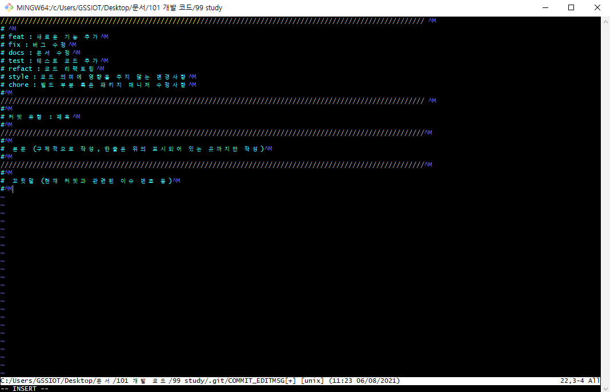

# git commit message template

## 1. git commit message template 

### 1.1. git commit message template의 필요성
--------------------------------------------------------------------------------
  현재 진행중인 프로젝트는 기능 추가, 기능 수정 등이 빈번하지 않다보니 버전별로 코드를 관리하는 것이 빈번하지  않았다. 그러다보니 Git Commit Message를 아주 간략하게 남기곤 했는데, 앞으로 프로젝트의 버전별 관리가 빈번해질 것으로 판단되어 Git Commit Message를 신경써야 할 거 같다는 생각이 들었다. 그리고 Commit Message를 의미있고, 효과적인 방법으로 남기는 습관을 들이고 싶었다.  

  구글링을 해본 결과 일반적으로 사용하는 Commit Message 템플릿이 존재하는 걸 알게 되었고, 해당 템플릿을 적용하여 앞으로는 의미있는 Commit Message를 남기도록 해야겠다. 그럼 템플릿을 적용하는 방법에 대해 간단히 알아보자.

### 1.2. git commit message template 적용방법
--------------------------------------------------------------------------------
  Git Commit Message Template을 적용하는 방법은 아주 간단하다. 우선, 사용할 Template 텍스트 파일을 작성한다. 나는 구글링을 통해 일반적으로 사용하는 템플릿을 선택하였다. 해당 템플릿에 대해 핵심만 설명하자면 Commit을 유형별로 구분지어 Message를 작성하는 방법이다.

  Template 텍스트 파일 작성이 끝난 뒤에는 Git Bash를 실행시킨 후 다음 명령어를 입력하여 템플릿을 적용시킨다. 

``` bash
	
	git conifg --global commit.template ./home/User/example_template.txt

```

  위 명령어를 통해 템플릿을 적용한 후 *--m 태그* 를 제외한 commit 명령을 실행시키면  Vim 에디터가 실행되어 작성한 템플릿을 확인할 수 있으며 해당 화면을 통해 Commit Message를 작성할 수 있다. 

