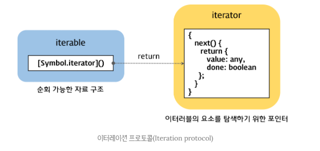
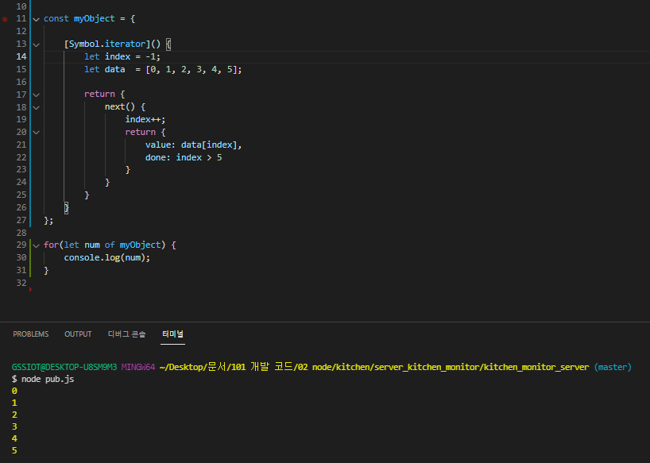

# For 문 유형별 정리

## 1. For문 유형별 정리

### 1.1. 개요
--------------------------------------------------------------------------------
  자바스크립트에는 여러 for문이 존재한다. 그러나 사용할 때마다 헷갈려 매번 찾아보곤 한다. 그래서 이번에 for문을 깔끔하게 정리하고 학습하고자 한다. 완벽하게 사용처와 사용법을 익혀보도록 하자.

### 1.2. for of
--------------------------------------------------------------------------------
  MDN에 따르면 **for..of 명령문은 반복가능한 객체(iterator object)에 대해 반복**문을 수행한다고 한다. 대표적으로 배열이 있을 수 있다. 

``` javascript

	for(variable of iterable) {
		// Do Something..
	}

```

각 반복시 요소에 해당하는 값을 variable 위치에 삽입한다. 정확히는 iterator의 next() 메소드가 반환하는 value 값을 variable에 대입한다. iterator와 관련된 내용은 아래서 다루도록 하자.

### 1.3. for in
--------------------------------------------------------------------------------
  *for..in*문은 모든 객체에서 사용이 가능하다. 그리고 자바스크립트는 모든 것이 객체이다. MDN에 따르면 **for..in문은 non-Symbol 속성에 대해서만 반복**한다고 한다. non-Symbol은 Symbol 함수로 키가 지정되지 않음을 의미한다. 참고로 배열도 객체이며 인덱스는 정수로 표현된 non-Symbol 속성이다. 따라서, 배열도 *for..in*문을 통해 작업이 가능하다.

``` javascript

	for(property in object) {
		// Do Something..
	}

```

각 반복시 해당 속성이름을 property에 삽입한다..

### 1.4. iteration protocols
--------------------------------------------------------------------------------
  이터레이션 프로토콜은 데이터 컬렉션을 순회하기 위한 프로토콜이다. 이터레이션 프로토콜을 준수한 객체는 for..of 문으로 순회가능하며, Spread 문법의 피연산자가 될 수 있다. **이터레이션 프로토콜**은 **이터러블 프로토콜**과 **이터레이터 프로토콜**로 구성되어 있다.


#### 1.4.1. iterable protocols
  이터러블 프로토콜은 iteration 행동을 정의하여 데이터 컬렉션을 순회할 수 있도록 한다. 이터러블은 **Symbol.iterator의 메소드가 구현**되어 있어야만 한다. 즉, Symbol.iterator 메소드가 속성(**@@iterator**)으로 구현되어 있으면 이터러블 객체가 된다. 


#### 1.4.2. iterator protocols
  Symbol.iterator 메소드는 이터레이터를 반환한다. 그리고 이터레이터는 **next( )메소드가 구현**되어 있어야만 한다. 그리고 **next( )메소드는 이터레이터 리절트 객체를 반환하는데 이 객체는 value와 done 프로퍼티**를 갖는다. 자세한 내용은 [여기](https://developer.mozilla.org/en-US/docs/Web/JavaScript/Reference/Iteration_protocols) 참조.




#### 1.4.3. iteration protocols 정리
  * iteration protocols = iterable protocol 준수 + iterator 프로토콜 준수
  
  * iterable protocol 준수 = Symbol.iterator 구현 -> iterator 반환(이 값이 iterator protocol 준수 시 iteration protocol 준수함을 의미)
   
  * iterator protocol 준수 = next( ) 구현 -> iterator result 반환 = value, done 프로퍼티 포함 객체


#### 1.4.4. 커스텀 iterable 객체

  위의 내용을 통해 커스텀 iterable 객체를 생성해보았다. 결과는 아래와 같다.




### 1.5. 최종 정리
--------------------------------------------------------------------------------

  * for..of 는 iterable 객체만 허용.
  * for..in 은 모든 객체 허용. 단, non-Symbol 속성에 대해서만 허용.