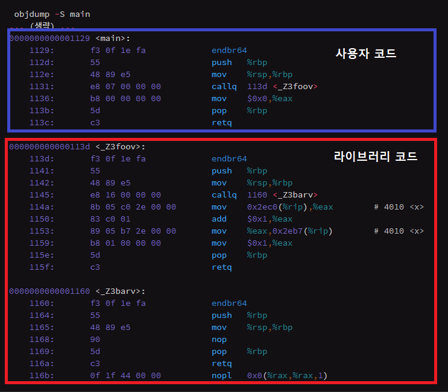
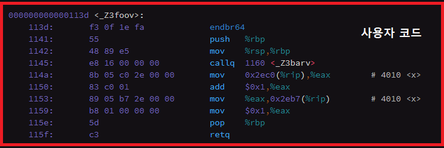

# 라이브러리

## 1. 개요
* * *
  C/C++ 프로젝트를 진행하면서 그동안 제대로 알지 못했던 라이브러리와 관련된 개념과 사용법을 정리해보고자 한다.

## 2. 라이브러리
* * *
#### 2.1. 라이브러리란?
  라이브러리는 자주 사용되는 부분 프로그램(함수)들을 모아 놓고, 언제든지 이용할 수 있도록 구성된 형태를 의미한다. 일반적으로 라이브러리는 바이너리 형태를 갖지만, 바이너리 형태가 아닌 소스 형태, 로드 형태를 가질 수 있다.

  일반적으로 라이브러리는 헤더 파일을 포함하고 있으며, 헤더 파일은 라이브러리에 포함된 함수의 프로토타입을 모아 놓은 소스 형태의 파일이다. 그리고 컴파일 과정에서 해당 헤더 파일을 이용하여 링킹 과정에 필요한 심볼 네임을 생성한다. 링킹 과정에서는 심볼 네임을 이용하여 라이브러리(바이너리 형태)를 확인하고 링크를 하여 실행파일을 생성한다. 


#### 2.2. 라이브러리의 종류


##### 2.2.1. 정적 라이브러리

  정적 라이브러리는 링킹이 이루어지는 과정에서 필요한 코드를 프로그램에 적재하여 하나의 실행파일(위 그림 참고)을 만든다. 즉, 정적 라이브러리는 **링크 타임에 바인딩 된다고 생각하면 된다.** 결과 실행파일은 외부 의존도가 없어, 이식성이 좋고 외부 참조에 따른 속도 저하가 발생하지 않는다. 그러나 실행파일의 크기가 커지고, 해당 라이브러리를 수정할 경우, 해당 라이브러리를 사용한 모든 프로그램을 다시 빌드해야 한다는 단점이 존재한다. 



  위의 그림은 임의의 라이브러리를 사용한 사용자 코드의 오브젝트 파일덤프이다. 그림을 보면 단순히 라이브러리의 부분이 사용자 프로그램과 같이 적재되어 하나의 파일로 표현되는 것을 확인할 수 있다. 다음은 운영체제별 정적 라이브러리의 확장자를 나타낸 것이다.

``` text
	window : *.lib
	linux  : *.a
```

##### 2.2.2. 공유(동적) 라이브러리

  공유 라이브러리는 프로그램 런타임시에 링크되는 라이브러리이다. 따라서, 실행 파일의 크기 축소, 컴파일 시간 단축, 라이브러리 업데이트 시 편리함 등의 장점을 가지고 있다. 그러나 외부 참조(동적 링킹)에 따른 속도 저하가 발생하며, 설정하기 다소 어렵다는 단점이 존재한다.



  위의 그림은 공유 라이브러리를 사용한 사용자 코드의 오브젝트 파일덤프이다. 그림을 보면 단순히 사용자 프로그램 코드만이 존재하는 것을 확인할 수 있다. 다음은 운영체제별 공유 라이브러리의 확장자를 나타낸 것이다.

``` text
	window : *.dll
	linux  : *.so
```


## 3. 라이브러리 설정 방법

* * *
#### 3.1. 정적 라이브러리 추가하기 (Window/Visual Sutdio)
https://blessingdev.wordpress.com/2017/09/26/visual-studio%EC%97%90-%EC%99%B8%EB%B6%80-%EB%9D%BC%EC%9D%B4%EB%B8%8C%EB%9F%AC%EB%A6%AC-%EC%B6%94%EA%B0%80%ED%95%98%EA%B8%B0/

#### 3.2. 공유(동적) 라이브러리 추가하기 (Window/Visual Studio)
https://wnsgml972.github.io/setting/2018/11/01/dll_lib/


